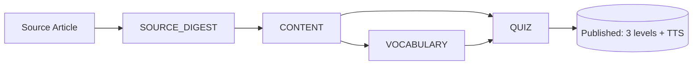

# CurioFeed 🚀
Fuel your curiosity, Master your English.

CurioFeed is a content-driven English learning platform that enables users to improve their English skills while reading articles and columns they are genuinely interested in.

By strategically transforming complex articles into optimized learning tiers, CurioFeed bridges the gap between high-level editorial content and individual linguistic capabilities, creating a seamless flow from curiosity to fluency.

**🔗 Live Demo: [curio-feed.pages.dev](https://curio-feed.pages.dev)**

> CurioFeed is designed as a **mobile-first reading experience** — for the best impression, open the demo on a phone or a narrow browser window. On wide screens the app renders inside a centered device frame.

## 🌟 Key Features

* **Curated Learning Feed**: A hand-picked selection of high-quality articles across Tech, Business, and Culture—ensuring users learn from the best sources.
* **Tri-Level Content Scaling**: Every article is pre-transformed into **Easy, Medium, and Hard** versions using LLM orchestration, optimizing for both readability and linguistic progression.
* **Optimized Multimodal Experience**: High-fidelity TTS audio is pre-generated and cached for instant playback. This enables simultaneous reading and listening to enhance phonetic awareness and auditory comprehension.
* **Interactive Vocabulary Insights**: A smart tooltip system provides instant English-to-English definitions and contextual examples, fostering an immersive "thinking in English" environment.
* **Contextual Knowledge Validation**: Dynamically generated comprehension and vocabulary quizzes reinforce learning and track progress through data-driven insights.

## 🏗 System Architecture & Tech Stack

This project is structured as a monorepo with clear separation between frontend, backend, and infrastructure components.

| Layer | Technology |
|-------|------------|
| **Backend** | Java 21, Spring Boot 3.2, Spring Data JPA, Flyway (migrations) |
| **Frontend** | React 18 + Vite, TypeScript, Tailwind CSS, TanStack Query |
| **AI / Media** | Google Gemini API (content generation), Google Cloud Text-to-Speech (TTS) |
| **Data** | PostgreSQL (JSONB for flexible quiz schemas; UUID v7 for time-ordered cursor pagination) |
| **Testing** | JUnit 5, Testcontainers (`postgres:16`), Vitest + Testing Library |
| **Observability** | Spring Actuator, Micrometer → Prometheus / Grafana Cloud |
| **Infra** | Docker, Docker Compose |

## 🤖 AI Content Pipeline

Every source article is transformed into three reading levels (**EASY / MEDIUM / HARD**), and each level runs through a tracked, resumable 4-step generation pipeline:



The pipeline is built to run as an **operable system**, not a one-shot prompt:

- **Job tracking** — one `ArticleGenerationJob` per article → one `SubJob` per difficulty level → per-step `StepJob` records.
- **Step-level retries** — any step (CONTENT / VOCABULARY / QUIZ) can be re-run independently; retrying an upstream step invalidates dependent steps.
- **Validation & quality scoring** — generated content is validated (e.g. title-similarity, level-appropriate score thresholds) before a level is published.
- **Pre-generated multimodal assets** — TTS audio is generated and cached per level for instant playback.

A protected admin console (`/admin`) exposes this pipeline: article ingestion, per-step status, and manual retries.


## 🚦 How to run locally

The entire stack is containerized for easy local development.

1. Ensure Docker and Docker Compose are installed.
2. From the root directory, navigate to `/infra` and run the infrastructure:
   ```bash
   cd infra
   docker-compose up -d --build
   ```
3. Access Services:
   - **Frontend**: http://localhost:3000
   - **Backend API**: http://localhost:8080 (health check at `/actuator/health`)
   - **Admin console**: http://localhost:3000/admin — set `ADMIN_API_TOKEN` in `infra/.env` (see `infra/.env.example`) and enter it when prompted.


## 🚀 Production Deployment

The live demo runs on a managed, low-cost stack:

- **Frontend**: **Cloudflare Pages** (global CDN + edge delivery). API base URL is injected at build time via `VITE_API_BASE_URL`.
- **Backend**: containerized Spring Boot service on **Render** (`render.yaml`), with a managed PostgreSQL instance.
- **Admin API security**: `/api/admin/**` is guarded by a shared token — set `ADMIN_API_TOKEN` in the backend environment and supply it via the `X-Admin-Token` header (the admin console prompts for it). When unset, the admin API is fail-closed (returns `503`).

> A self-hosted alternative (Oracle Cloud Always Free VM + Caddy + Neon PostgreSQL) is documented in [`docs/DEPLOYMENT_PHASE1.md`](docs/DEPLOYMENT_PHASE1.md) and the [full infrastructure plan](implementation_plan.md).

## 📐 Design Decisions

Some of the architectural "why" behind CurioFeed:

- **Java 21 + Spring Boot 3.2** — virtual threads for cheap concurrency in the generation pipeline, and a long-support baseline.
- **Content caching over on-the-fly generation** — all three reading levels and their TTS audio are pre-generated and cached, so the read/listen experience is instant and LLM/TTS cost is bounded and predictable.
- **PostgreSQL JSONB for quiz schemas** — multiple-choice, short-answer, and scramble quizzes share one flexible column instead of rigid per-type tables.
- **UUID v7 + cursor pagination** — time-ordered IDs make `(published_at, id)` cursors stable without a separate sort key.

## 🗺 Roadmap

**Done**
- ✅ Tri-level (Easy/Medium/Hard) LLM content pipeline with step-level retries
- ✅ Pre-generated, cached TTS audio per level
- ✅ Metrics & observability (Prometheus / Grafana Cloud)
- ✅ Token-protected admin console

**Next**
- Spaced repetition system (SRS) for vocabulary retention
- Personalized recommendations based on reading behavior
- Progress analytics for comprehension and vocabulary growth
- Fully asynchronous generation pipeline (queue-based)

## 🤝 Contact
Lily (Eunah Yang) — Software Engineer at Samsung Electronics
LinkedIn: [Eunah Yang](https://www.linkedin.com/in/eunah-yang-3a86553a4/)
Email: yua12271109@gmail.com