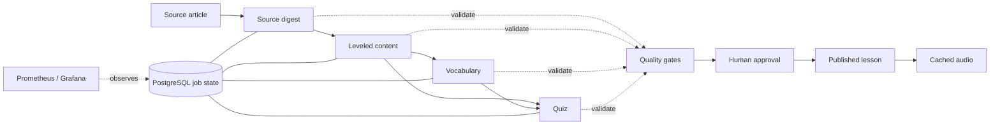

# CurioFeed

**A production-grade English learning platform powered by a validated, recoverable LLM pipeline.**

CurioFeed turns real articles into level-appropriate reading, vocabulary, audio, and quizzes. Each article is transformed into Easy, Medium, and Hard versions through a tracked four-stage pipeline built for validation, targeted retries, model failover, and human approval.

[Live app](https://curio-feed.pages.dev) · [Engineering case study](https://lily-eunah.github.io/curiofeed-case-study/) · [Medium series](https://medium.com/@yua12271109)

> The reader is mobile-first. Open the live app on a phone or in a narrow browser window for the intended experience.


## Engineering outcomes

| Area | Result |
| --- | --- |
| LLM reliability | Raised generation success from **46.7% to 95.0%** with validation and step-level corrective retries |
| Cost efficiency | Reduced token use by **39.9%** by retrying only the failed stage instead of regenerating the full article |
| Database performance | Replaced an O(N) cursor predicate with an index seek, reducing a depth-500k read from **~9.5s to 1.8ms** on a 1M-row benchmark |
| Operational recovery | Added atomic job locking, heartbeats, and reconciliation for stalled generation work |
| Safety | Added fact-digest rewriting, title-similarity blocking, quality gates, and human approval before publication |

The LLM figures come from a fixed evaluation set of 15 article-and-difficulty runs. The pagination result is a scoped `EXPLAIN ANALYZE` benchmark, not a general latency claim.

## Product experience

- Three reading levels—Easy, Medium, and Hard—from the same source article
- Pre-generated, cached audio with a seekable player
- English-to-English vocabulary definitions and contextual examples
- Comprehension and vocabulary quizzes
- Saved and continue-reading states
- Protected operator console for ingestion, review, retry, and publishing

## System architecture


```mermaid
flowchart LR
    A[Source article] --> D[Source digest]
    D --> C[Leveled content]
    C --> V[Vocabulary]
    C --> Q[Quiz]
    V --> Q

    D -. validate .-> G[Quality gates]
    C -. validate .-> G
    V -. validate .-> G
    Q -. validate .-> G

    G --> H[Human approval]
    H --> P[Published lesson]
    P --> T[Cached audio]

    J[(PostgreSQL job state)] --- D
    J --- C
    J --- V
    J --- Q
    O[Prometheus / Grafana] -. observes .-> J
```

Every article creates one generation job, three level-specific sub-jobs, and a tracked job for each pipeline stage. Retrying an upstream stage invalidates only its dependents. Heartbeats and reconciliation recover work left behind by a failed worker.

## Reliability design

- **Structured output:** generated data is parsed into typed schemas instead of accepted as free-form text.
- **Targeted recovery:** only the failed stage is repaired or regenerated.
- **Dependency-aware retries:** regenerating content also refreshes its derived vocabulary and quiz.
- **Fail-closed publishing:** content must clear automated checks and receive human approval.
- **Provider boundary:** the LLM client is isolated behind a provider-agnostic interface for model swaps and benchmarking.
- **Rate control:** generation is globally throttled to respect model quotas across concurrent workers.
- **Observability:** pipeline state, timing, failures, and rate-limit behavior are exposed through application metrics.

## Tech stack

| Layer | Technology |
| --- | --- |
| Backend | Java 21, Spring Boot 3.2, Spring Data JPA, Flyway |
| Frontend | React 18, TypeScript, Vite, TanStack Query |
| AI | Google Gemini behind a provider-agnostic client layer |
| Data | PostgreSQL, JSONB, UUID v7 keyset pagination |
| Testing | JUnit 5, Testcontainers, Vitest, Testing Library |
| Operations | Docker, Micrometer, Prometheus, Grafana |
| Hosting | Cloudflare Pages, Render, managed PostgreSQL |

## Repository structure

```text
backend/    Spring Boot API, generation pipeline, persistence, and tests
frontend/   Reader and operator interfaces
infra/      Local Docker Compose and observability configuration
docs/       Deployment and engineering notes
```

## Run locally

### Prerequisites

- Java 21
- Node.js and npm
- Docker with Docker Compose

Start PostgreSQL:

```bash
cd infra
docker compose up -d db
```

Start the backend:

```bash
cd backend
./gradlew bootRun
```

Start the frontend in a second terminal:

```bash
cd frontend
npm install
npm run dev
```

The frontend runs at `http://localhost:5173`; the backend runs at `http://localhost:8080`.

External generation requires provider credentials. Use the checked-in example configuration as a guide, keep real credentials out of Git, and do not run live model tests unless you intend to consume quota.

## Verify changes

```bash
cd backend
./gradlew test

cd ../frontend
npm run lint
npm run test
npm run build
```

Default tests exclude live model integrations. The backend uses Testcontainers PostgreSQL so JSONB, migrations, and database behavior are exercised against the production database family rather than an in-memory substitute.

## Further reading

- [Engineering Reliable LLM Pipelines: From 46.7% to 95%](https://medium.com/@yua12271109/engineering-reliable-llm-pipelines-from-46-7-to-95-f560ae4b311e)
- [Your "Cursor Pagination" May Still Be O(N)](https://medium.com/@yua12271109/your-cursor-pagination-may-still-be-o-n-from-offset-to-a-real-index-seek-9177c613aaa7)
- [The Fastest Hibernate Fetch Plan Wasn't One Query](https://medium.com/@yua12271109/the-fastest-hibernate-fetch-plan-wasnt-one-query-be8e88878afa)

## Author

Built by [Eunah (Lily) Yang](https://www.linkedin.com/in/eunah-yang-3a86553a4/).

## License

No open-source license is currently granted. The source is publicly available for portfolio review; all rights are reserved unless a license is added.
