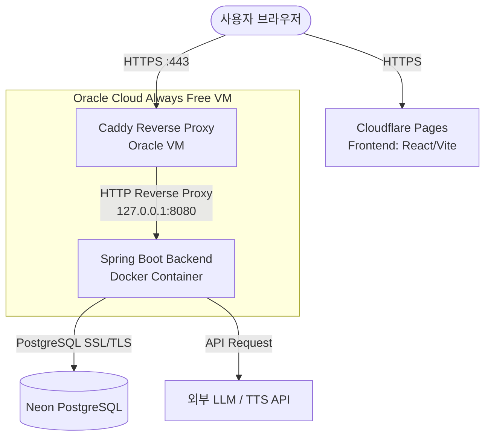

# Curio Feed 배포 및 인프라 설계서 (Deployment & Infrastructure Plan)

이 설계서는 Curio Feed MVP 서비스를 비용 효율적으로 배포하고, 추후 광고/상업화가 가능하도록 설계된 확정 기술 스택 기반의 배포 및 운영 계획입니다.

---

## 1. 확정 인프라 아키텍처 (Infrastructure Architecture)

Curio Feed의 최종 프로덕션 배포 아키텍처는 아래와 같이 구성됩니다.



* **Frontend**: **Cloudflare Pages**에 배포되어 상업적 이용 및 트래픽에 대응하며, 기본 도메인과 HTTPS를 무료로 제공받습니다.
* **Backend**: **Oracle Cloud Always Free VM** (Ubuntu) 내부에서 Docker 컨테이너로 독립 실행됩니다.
* **Database**: 서버리스 PostgreSQL 서비스인 **Neon DB**를 사용하여 영구 무료로 DB를 안정적으로 관리합니다.
* **Proxy/Security**: **Caddy**를 활용하여 Let's Encrypt SSL 인증서를 자동으로 발급받고 내부 백엔드 서비스(8080)로 리버스 프록시를 처리합니다. 백엔드의 8080 포트는 외부 방화벽으로 차단됩니다.

---

## 2. 도메인 구매 전/후 배포 단계 (Phased Deployment)

도메인이 아직 준비되지 않은 상황을 고려하여 **Phase 1 (도메인 구매 전)**과 **Phase 2 (도메인 구매 후)**로 단계를 나누어 배포를 검증하고 개시합니다.

### Phase 1. 도메인 구매 전 MVP 인프라 준비
도메인 구매 전에는 Cloudflare Pages 프론트엔드와 Oracle VM 백엔드를 직접 공개 연동하지 않는 것을 기본값으로 삼습니다. 또한 백엔드 8080 포트를 외부에 열지 않고 루프백에 바인딩하여 보안 위협을 원천 차단합니다.

1. **Oracle VM 생성 및 환경 구축**: Ubuntu VM 인스턴스를 생성하고 Docker, Docker Compose, Git을 설치합니다.
2. **Neon DB 연동**: 무료 데이터베이스 생성 후 Connection String을 확보합니다.
3. **Backend 배포**: VM 환경에서 Docker Compose를 구동하여 Backend API 서버를 컨테이너로 시작합니다.
   * 이때 포트는 내부 루프백인 `127.0.0.1:8080:8080`에 바인딩하여 외부 접근을 금지합니다.
4. **Phase 1 API 호출 및 기능 검증 방식**:
   * **방법 A (로컬 개발 연동)**: 로컬 개발 환경(`http://localhost:5173`)에서 API 주소를 로컬 백엔드(`http://localhost:8080`)로 지정하여 동작을 검증합니다.
   * **방법 B (포스트맨/curl 직접 호출)**: SSH 터널링을 이용해 로컬 포트와 VM의 8080 포트를 매핑하여 직접 API를 테스트합니다.
   * **방법 C (Cloudflare Quick Tunnel 임시 검증)**: Cloudflare Pages 프론트와 연동한 실서버 API 테스트를 진행하고 싶은 경우, `cloudflared` Quick Tunnel을 임시로 구동하여 프론트의 Mixed Content 제약을 우회합니다.
     * VM 내부 터미널에서 다음 명령 실행하여 임시 HTTPS 터널 생성:
       ```bash
       cloudflared tunnel --url http://localhost:8080
       ```
     * 터널 실행 시 생성되는 임시 도메인(`https://*.trycloudflare.com`)을 복사합니다.
     * Cloudflare Pages 환경변수 `VITE_API_BASE_URL` 값에 해당 임시 HTTPS 주소를 임시로 입력하여 배포한 후, 검증을 진행합니다.

### Phase 2. 도메인 구매 후 공개 서비스 연결
1. **도메인 구매**: 도메인 등록 대행 업체를 통해 `curiofeed.com` 구매를 완료합니다.
2. **Cloudflare DNS 설정**: 
   * `curiofeed.com` & `www.curiofeed.com` → Cloudflare Pages로 CNAME 레코드 연결.
   * `api.curiofeed.com` → Oracle VM의 공인 IP로 A 레코드 연결.
3. **Caddy 리버스 프록시 구축**:
   * Oracle VM 내부에서 Caddy를 실행하여 `api.curiofeed.com` 도메인에 대한 Let's Encrypt SSL/TLS 인증서를 자동 발급받습니다.
   * Caddy가 외부에서 `https://api.curiofeed.com`으로 들어오는 포트 443 요청을 받아, 내부 루프백 주소인 `127.0.0.1:8080`으로 포워딩하도록 설정합니다.
4. **방화벽 차단**: Oracle VM의 외부 포트는 오직 Caddy 포트(80, 443)와 SSH 포트(22)만 허용합니다. (8080 포트는 호스트 내부 바인딩 상태 유지)
5. **환경변수 업데이트**:
   * Cloudflare Pages의 `VITE_API_BASE_URL` 값을 `https://api.curiofeed.com`으로 수정하고 재배포합니다.
   * 백엔드의 CORS `allowed-origins` 설정을 프로덕션용으로 업데이트합니다.

---

## 3. Backend 운영 설정 (Backend Production Settings)

### 3.1 Spring Boot Production 설정 (`application-prod.yml`)
실서버 환경의 데이터베이스 연결, 커넥션 풀 크기, JPA 설정을 정의하는 `application-prod.yml`을 구성합니다.

```yaml
spring:
  config:
    activate:
      on-profile: prod
  datasource:
    url: ${SPRING_DATASOURCE_URL}
    username: ${SPRING_DATASOURCE_USERNAME}
    password: ${SPRING_DATASOURCE_PASSWORD}
    driver-class-name: org.postgresql.Driver
    hikari:
      # 무료 VM 및 무료 DB에 최적화하여 커넥션 풀을 최소로 제한
      maximum-pool-size: 3
      minimum-idle: 0
      idle-timeout: 30000
      max-lifetime: 600000
      connection-timeout: 20000
  jpa:
    hibernate:
      # MVP 초기 정책에 따라 설정을 관리합니다. (3.4 정책 참조)
      ddl-auto: update
    properties:
      hibernate:
        dialect: org.hibernate.dialect.PostgreSQLDialect
        jdbc:
          lob:
            non_contextual_creation: true

# Actuator 보안 강화 설정
management:
  endpoints:
    web:
      exposure:
        include: health # health 엔드포인트만 외부 노출
  endpoint:
    health:
      show-details: never # 상세 시스템 사양 노출 금지
```

* > [!IMPORTANT]
  > Neon DB 연결을 위한 `SPRING_DATASOURCE_URL`의 JDBC 포맷 규칙:
  > `jdbc:postgresql://<neon-host-name>/curio_feed?sslmode=require`

### 3.2 JVM 메모리 최적화 옵션
Oracle Cloud Free Tier VM의 한정된 리소스(또는 512MB~1GB 미만 인스턴스)에서 OOM(Out of Memory)을 사전에 차단하기 위해 Docker 컨테이너 실행 시 다음 옵션을 JVM 아규먼트로 제공합니다.

* **옵션**: `JAVA_TOOL_OPTIONS=-Xms128m -Xmx256m -XX:+UseSerialGC`
  * `-Xms128m`: 초기 힙 메모리를 128MB로 지정하여 서버 기동 시 불필요한 시스템 리소스 선점 방지.
  * `-Xmx256m`: 최대 힙 메모리를 256MB로 제어하여 VM 전체 메모리 고갈 방지.
  * `-XX:+UseSerialGC`: 싱글 CPU 스레드를 사용하는 직렬 GC를 활용하여 CPU 컨텍스트 스위칭 부담 최소화.
  * *참고*: 향후 VM 인스턴스를 더 크게 증설(예: Oracle ARM 4vCPU, 24GB RAM 등)하게 되면 성능 저하를 방지하기 위해 이 최적화 제한 값을 상향하거나 GC를 G1GC 등으로 교체하도록 조정할 수 있습니다.

### 3.3 Health Check 도입
실서버 배포 상태 검증을 위해 Spring Boot Actuator를 연동합니다.
* `spring-boot-starter-actuator` 의존성을 추가하여 `/actuator/health`만 외부 공개합니다.
* Caddy 프록시 설정이 완료된 후, 외부에서 `https://api.curiofeed.com/actuator/health` 호출 시 정상 응답(HTTP 200, status: "UP")을 반환해야 합니다.

### 3.4 JPA ddl-auto 정책 가이드라인
* **MVP 초기 단계**: 테이블 구조의 잦은 변경을 지원하기 위해 `ddl-auto: update`를 제한적으로 사용합니다.
* **운영 및 사용자 적재 단계**: 실제 유저 정보 및 콘텐츠 데이터가 적재된 이후에는 데이터 파손 방지를 위해 반드시 `ddl-auto: validate` 또는 `none`으로 즉시 전환합니다.
* **DB 마이그레이션**: 서비스 확장 시점에는 스키마 변경 이력을 형상관리하기 위해 Flyway 또는 Liquibase 도구를 도입하는 마이그레이션 로드맵을 수립하고 production 전환 시 이를 검토합니다.

### 3.5 CORS 설정
* **CORS allowed origins 허용 대상**:
  * 로컬 개발: `http://localhost:5173`
  * Phase 1 임시: Cloudflare Quick Tunnel 주소 (`https://*.trycloudflare.com`)
  * Phase 2 프로덕션:
    * `https://curiofeed.com`
    * `https://www.curiofeed.com`
    * Cloudflare Pages 기본 도메인 (`https://*.pages.dev`)
* credentials를 사용하지 않는다면 보안을 위하여 `allowCredentials(true)`는 적용하지 않는 방향으로 설계합니다.

### 3.6 API Key 보안
* GPT API, Gemini LLM API, TTS API Key 등 일체의 자격 증명은 절대로 Frontend에 노출하지 않습니다.
* 운영 환경변수 또는 `.env` 파일을 통해 주입받으며, 해당 파일은 절대 Git에 커밋하지 않고 로컬 VM 내 안전한 디렉토리에만 보관합니다.

---

## 4. Frontend 배포 설정 (Frontend Deployment)

### 4.1 API Base URL 관리
하드코딩된 API 주소를 제거하고 Vite 환경 변수를 주입받도록 개선합니다.
* API 연동 Axios/Fetch 모듈 예시:
  ```typescript
  const API_BASE_URL = import.meta.env.VITE_API_BASE_URL || 'http://localhost:8080';
  ```
* Cloudflare Pages 환경변수 설정에서 `VITE_API_BASE_URL` 키를 추가하고 해당 단계에 맞는 주소를 설정합니다.
  * Phase 1: `https://*.trycloudflare.com` (Quick Tunnel 연결 시)
  * Phase 2: `https://api.curiofeed.com`

### 4.2 Single Page Application (SPA) 라우팅 Fallback 설정
React Router 등 클라이언트 사이드 라우팅을 사용하는 경우, Cloudflare Pages에서 새로고침 시 404 에러가 발생하는 현상을 예방합니다.
* `frontend/public/` 경로 하위에 `_redirects` 파일을 생성합니다.
  ```text
  /* /index.html 200
  ```
* 빌드 과정에서 이 파일이 최상위 배포 경로로 전달되어, 서버는 항상 `index.html`로 진입 처리를 대행하게 만듭니다.

### 4.3 UI/UX 대응 요소
* **API Loading UI**: API 호출 지연 시 화면이 비어있지 않도록 스켈레톤 UI 또는 스피너 제공.
* **API Failure UI**: API 호출 도중 서버 에러가 발생한 경우 에러 메시지와 '다시 시도' 버튼 제공.
* **Network Disconnected Fallback**: 네트워크 오프라인 또는 백엔드가 응답하지 않는 상황 시 "서버 점검 중이거나 인터넷 연결이 원활하지 않습니다" 안내 모달 노출.
* **Mobile-First Layout**: 테일윈드 CSS의 `max-w-md mx-auto` 설정을 기반으로 모바일 중심 레이아웃 유지.

---

## 5. Database 설계 변경사항 (Database Schema)

학습 소스 표시와 영어 수준별 콘텐츠 관리를 효율화하기 위해 `Article` 또는 관련 엔티티 스키마를 아래와 같이 변경 및 신설합니다. MVP 단계에 어울리도록 워크플로우를 극단적으로 단순화하여 `status` 필드를 통해서만 상태를 관리합니다.

### 5.1 엔티티 수정 스펙 (`Article` Entity)

```java
@Entity
@Table(name = "articles")
public class Article {

    @Id
    @GeneratedValue(strategy = GenerationType.IDENTITY)
    private Long id;

    // --- 소스/저작권 관련 정보 ---
    @Column(nullable = false)
    private String sourceTitle;       // 원문 기사의 원제목
    
    @Column(nullable = false, length = 1000)
    private String sourceUrl;         // 출처 링크 URL
    
    @Column(nullable = false)
    private String sourcePublisher;   // 기사의 출처 언론사/발행처 (예: BBC, CNN, Medium)
    
    @Column(nullable = false)
    private LocalDateTime sourcePublishedAt; // 원문 기사 작성일시
    
    @Column(nullable = false)
    private LocalDateTime sourceAccessedAt;  // 크롤링/수집 일시

    // --- 난이도별 데이터 분리 ---
    @Column(nullable = false)
    private String easyTitle;         // 쉬운 버전 제목
    @Column(nullable = false, columnDefinition = "TEXT")
    private String easyContent;       // 쉬운 버전 본문
    private String easyAudioUrl;      // 쉬운 버전 오디오 파일 링크

    @Column(nullable = false)
    private String mediumTitle;       // 중간 버전 제목
    @Column(nullable = false, columnDefinition = "TEXT")
    private String mediumContent;     // 중간 버전 본문
    private String mediumAudioUrl;    // 중간 버전 오디오 파일 링크

    @Column(nullable = false)
    private String hardTitle;         // 어려운 버전 제목
    @Column(nullable = false, columnDefinition = "TEXT")
    private String hardContent;       // 어려운 버전 본문
    private String hardAudioUrl;      // 어려운 버전 오디오 파일 링크

    // --- 운영 상태 관리 ---
    @Enumerated(EnumType.STRING)
    @Column(nullable = false)
    private ArticleStatus status = ArticleStatus.DRAFT; // 기본값 DRAFT

    // Getter, Setter, Constructors 등...
}

public enum ArticleStatus {
    DRAFT,      // 초안 (사용자 비노출, 편집 대기)
    PUBLISHED,  // 서비스에 공개 발행 상태
    ARCHIVED    // 아카이브 처리 (사용자 접근 불가)
}
```

---

## 6. Audio Storage 전략 (Audio Storage Strategy)

* **Oracle VM 내 저장 지양**: 영구 백업이 어려운 VM 인스턴스의 로컬 디렉토리에 TTS 오디오 파일을 생성하여 관리하는 방식은 향후 용량 관리 및 다중 배포 시 유지보수에 심각한 방해가 됩니다.
* **MVP 초기 구조**: 백엔드에서 생성된 오디오 파일은 외부에 임시/영구 업로드되어 해당 public URL 형태로만 데이터베이스(`easyAudioUrl`, `mediumAudioUrl`, `hardAudioUrl`)에 텍스트 형태로 저장됩니다.
* **향후 로드맵 (Cloudflare R2)**:
  * 무료 트래픽 이점 및 Cloudflare 생태계 이점을 살려 추후 **Cloudflare R2**로 스토리지 업로드 로직을 쉽게 전향하도록 설계합니다.
  * 백엔드 내 오디오 업로더 인터페이스(예: `AudioUploader`)를 사전에 선언하고 R2용으로 구현체를 갈아 끼울 수 있도록 분리합니다.

---

## 7. 저작권/출처 표기 정책 (Copyright and Attribution)

서비스의 상업화 및 광고 삽입 계획에 앞서 저작권 분쟁을 미연에 방지하기 위해 다음 원칙을 반드시 준수하여 데이터를 생성하고 뷰어단에 표기합니다.

### 7.1 데이터 생성 3대 원칙
1. **원문 복제 전면 금지**: 원문에 포함된 오리지널 문장을 그대로 백엔드 DB 또는 프론트엔드로 복사하지 않고, LLM을 통해 "핵심 사실(Factual Notes)만 추출"한 뒤 이를 활용하여 수준별로 100% 재작성합니다.
2. **독자적인 제목 및 구성**: 원문의 원제목과 유사한 제목을 차용하지 않고, 난이도 조절 가이드라인에 맞춘 직관적인 영문 제목을 새롭게 생성합니다.
3. **콘텐츠의 정체성 명시**: Curio Feed의 아티클은 "기존 뉴스의 번역/요약본"이 아니며, 학습 도우미로서 기획된 **"원문 사실 기반 영어 학습용 독자 콘텐츠"**임을 분명히 합니다.

### 7.2 하단 출처 표기 양식
모든 아티클 상세 정보 페이지 최하단에는 독자가 원래 정보를 탐색할 수 있는 출처를 다음과 같이 상시 표시합니다.

> "This CurioFeed lesson is original English-learning content created from factual notes based on the source below."
> **[기사제목](출처링크) - Published by (발행처) on (원문발행년월일)**

---

## 8. Oracle VM 운영 가이드 (Oracle VM Administration)

Oracle Cloud Always Free VM 인스턴스를 유지 및 관리하기 위한 표준 운영 절차입니다.

### 8.1 Always Free VM 리클레이밍(Idle Reclamation) 리스크 대응
Oracle Always Free VM은 Render처럼 요청이 없을 때 sleep 되지는 않지만, 90일 이상 CPU/Memory/Network 트래픽 사용률이 지극히 낮을 경우(유휴 상태) **인스턴스가 임의로 중단되거나 회수(Reclaimed)** 될 수 있는 정책이 존재합니다.

* **상태 상시 관리**: 
  * 백엔드 애플리케이션의 주기적인 상태 확인 절차(Health Check 모니터링 서비스 연동 등)를 준비합니다.
  * VM 사용률이 기준 미달로 감지되지 않도록 가벼운 스케줄링 태스크(예: 배치 로직 실행)를 구성합니다.
* **VM 강제 중지 시 비상 대응 절차**:
  1. Oracle Cloud Infrastructure(OCI) 콘솔 로그인.
  2. 컴퓨트 인스턴스 메뉴 이동 후 대상 VM의 상태 확인 및 '시작(Start)' 버튼을 통해 인스턴스 재부팅.
  3. 백엔드 서비스의 자동 재동작을 보장하기 위해 Docker 컨테이너의 restart 정책을 `restart: unless-stopped`로 유지.
* **데이터 보존 대책**:
  * 데이터는 서버리스 데이터베이스인 Neon DB에 저장되므로 VM이 다운되거나 회수되는 사고가 발생하더라도 사용자 정보 및 기사 데이터는 완벽히 안전합니다.
* **자산 백업**:
  * VM 내부에서만 생성되어 유지되는 설정 자산(`.env`, `Caddyfile`, 배포 쉘 스크립트 등)은 유실될 가능성에 대비하여 암호화된 안전한 프라이빗 스토리지나 로컬 PC에 이중 백업을 권장합니다.

### 8.2 초기 VM 세팅 가이드 (Ubuntu 기준)

1. **TimeZone 한국 표준시 설정**:
   ```bash
   sudo timedatectl set-timezone Asia/Seoul
   ```
2. **패키지 업데이트 및 기본 도구 설치**:
   ```bash
   sudo apt-get update && sudo apt-get upgrade -y
   sudo apt-get install -y git curl wget build-essential
   ```
3. **SSH 키 접속 및 보안 조치**:
   * SSH Key 생성 후 `~/.ssh/authorized_keys`에 등록.
   * 패스워드 로그인 및 root 계정 다이렉트 로그인 제한을 위해 `/etc/ssh/sshd_config` 파일 수정:
     ```text
     PermitRootLogin no
     PasswordAuthentication no
     ```
   * sshd 서비스 재기동: `sudo systemctl restart ssh`
4. **Docker & Docker Compose 설치**:
   * 공식 가이드 스크립트를 사용하여 최신버전 설치.
5. **UFW 방화벽 설정**:
   ```bash
   sudo ufw default deny incoming
   sudo ufw default allow outgoing
   sudo ufw allow 22/tcp      # SSH (본인 고정 IP만 허용하도록 추가 제한 설정 추천)
   sudo ufw allow 80/tcp      # HTTP (Caddy 발급용)
   sudo ufw allow 443/tcp     # HTTPS
   sudo ufw enable
   ```

### 8.3 Docker Compose 구조 (`infra/docker-compose.prod.yml`)

```yaml
version: '3.8'

services:
  backend:
    build:
      context: ../backend
      dockerfile: Dockerfile
    container_name: curio-feed-backend-prod
    restart: unless-stopped
    ports:
      # 외부 포트 8080에 127.0.0.1 루프백 주소를 바인딩하여,
      # 호스트의 Caddy는 접근 가능하지만 외부 인터넷 망에서는 8080으로 직접 접근할 수 없게 차단합니다.
      - "127.0.0.1:8080:8080"
    env_file:
      - .env
    environment:
      - SPRING_PROFILES_ACTIVE=prod
      - JAVA_TOOL_OPTIONS=-Xms128m -Xmx256m -XX:+UseSerialGC
```

* `.env` 파일 예시 (VM의 `infra/` 경로에 수동 배치):
  ```text
  SPRING_DATASOURCE_URL=jdbc:postgresql://ep-example.neon.tech/curio_feed?sslmode=require
  SPRING_DATASOURCE_USERNAME=my_neon_user
  SPRING_DATASOURCE_PASSWORD=my_neon_password
  APP_CORS_ALLOWED_ORIGINS=https://curiofeed.com,https://www.curiofeed.com,https://curio-feed.pages.dev
  LLM_API_KEY=your_key_here
  ```

### 8.4 Caddy 설정 (`/etc/caddy/Caddyfile`)

도메인 구매가 끝난 Phase 2 단계에서 VM의 Caddy 서비스를 설정하여 리버스 프록시와 SSL 자동 갱신을 적용합니다.

```text
api.curiofeed.com {
    reverse_proxy 127.0.0.1:8080
    
    # 보안 헤더 추가
    header {
        Strict-Transport-Security "max-age=31536000;"
        X-Content-Type-Options "nosniff"
        X-Frame-Options "DENY"
        Referrer-Policy "strict-origin-when-cross-origin"
    }
}
```

### 8.5 배포 쉘 스크립트 작성 (`deploy.sh`)
VM 상에서 코드를 빠르고 일관되게 무중단에 준하게 배포할 수 있는 쉘 스크립트를 `/opt/curiofeed/deploy.sh` 경로 등에 저장하여 활용합니다.

```bash
#!/bin/bash
set -e

# 배포 디렉토리로 이동
cd /opt/curiofeed

# 최신 소스 코드 pull
git pull origin main

# Docker 이미지 빌드 및 컨테이너 백그라운드 구동
docker compose -f infra/docker-compose.prod.yml build
docker compose -f infra/docker-compose.prod.yml up -d

# 안 쓰는 사용되지 않는 Docker 이미지 정리를 통해 VM 용량 보존
docker image prune -f

# 서비스 실행 상태 출력
docker compose -f infra/docker-compose.prod.yml ps
```

* **배포 실행 직후 운영자 확인 순서**:
  1. 컨테이너 작동 확인:
     ```bash
     docker compose -f infra/docker-compose.prod.yml ps
     ```
  2. 기동 로그 체크 (최신 100줄):
     ```bash
     docker compose -f infra/docker-compose.prod.yml logs --tail=100 backend
     ```
  3. 로컬 헬스체크 정상 응답 여부 판독:
     ```bash
     curl http://127.0.0.1:8080/actuator/health
     ```

### 8.6 서버 일상 점검 명령 가이드
서버 환경을 일상적으로 모니터링하기 위해 아래의 리눅스 도구와 명령들을 적극 활용합니다.
```bash
# 디스크 남은 용량 점검 (무료 용량 확보 상태 확인)
df -h

# 물리 메모리(RAM) 잔여량 확인 (Spring Boot 실행 가중 상태 체크)
free -m

# Docker 관련 시스템 디스크 공간 및 빌드 캐시 공간 소모율 체크
docker system df

# 백엔드 서비스 실행 상태 체크
docker compose -f infra/docker-compose.prod.yml ps

# 최근 구동 100줄 백엔드 실행 에러 로그 발생 모니터링
docker compose -f infra/docker-compose.prod.yml logs --tail=100 backend
```

---

## 9. 배포 순서 (Deployment Steps)

1. **Neon PostgreSQL 인스턴스 활성화** -> DB URL 정보 획득.
2. **Oracle VM에 코드 배포**:
   * 리포지토리 클론 및 `infra/.env` 파일 작성 (자격 증명 주입).
3. **Backend 실행**:
   * `docker compose -f docker-compose.prod.yml up -d --build` 명령으로 애플리케이션 시작.
4. **Cloudflare Pages 가입 및 배포**:
   * GitHub 계정으로 로그인하고 프론트엔드 레포지토리를 가져옵니다.
   * `Build settings` 지정 (Build command: `npm run build`, Output directory: `dist`).
   * **환경변수 지정**: `VITE_API_BASE_URL` 설정.
   * **SPA 리다이렉션**: `_redirects` 파일 생성 여부 체크.
5. **Phase 1 및 Phase 2 테스트 순서대로 진행**.

---

## 10. 검증 체크리스트 (Verification Checklist)

### Backend & DB
- [ ] Docker 빌드가 오류 없이 통과하는가?
- [ ] Oracle VM 기동 시 `docker ps` 상태가 정상(Up)으로 표시되는가?
- [ ] JVM 메모리 옵션(`-Xmx256m` 등)이 제대로 반영되어 컨테이너가 뜬 상태에서 램 점유율이 안정적인가?
- [ ] Neon DB에 테이블 스키마 DDL(JPA)이 정상 적용되어 테이블이 생성되었는가?
- [ ] `/actuator/health`가 외부 및 내부 호출 시 정상 응답하는가?
- [ ] VM 재부팅(Reboot) 시 `restart: unless-stopped` 정책에 의해 Docker 컨테이너가 자동으로 시작하는가?

### Frontend & UX
- [ ] Cloudflare Pages 빌드 파이프라인에서 오류가 없는가?
- [ ] 모바일 환경 및 PC 브라우저에서 스케일 조절 시 모바일 퍼스트 레이아웃이 깨지지 않는가?
- [ ] 아티클 리스트 및 수준별(Easy/Medium/Hard) 변경 탭이 자연스럽게 작동하는가?
- [ ] 오디오 미디어 플레이어가 동작하며, 사운드가 끊김 없이 정상 스트리밍되는가?
- [ ] 기기 통신 에러/서버 비정상 다운 타임 시 화면에 사용자 지향적인 Fallback UI(안내문)가 명시되는가?
- [ ] 저작권 원칙에 따른 팩트 기반 재생산 출처 양식이 기사 최하단에 정확히 노출되는가?

### Network & Security
- [ ] 도메인 구매 전의 경우 임시 HTTPS 연결(Cloudflare Quick Tunnel)을 활용하여 Mixed Content 에러 없이 동작이 확인되었는가?
- [ ] `api.curiofeed.com` DNS 전파가 정상적으로 완료되어 VM IP와 매핑되었는가?
- [ ] Caddy가 HTTPS TLS 인증서 발급에 성공하여 브라우저 접근 시 인증 필터 오류가 발생하지 않는가?
- [ ] API 호출 시 브라우저 콘솔에서 CORS 및 Mixed Content 에러가 보고되지 않는가?
- [ ] `.env` 등 민감 환경 정보 파일이 GitHub에 업로드되어 있지 않은가?
- [ ] VM 외부의 8080 포트로 요청 시 타임아웃/연결 거부 처리가 되는가? (보안 점검 완료)
- [ ] SSH 접속 시 비밀번호 기반 접근이 차단되고 오직 Key 인증만 수락되는가?

---

## 11. 추후 개선사항 (Future Enhancements)

1. **R2 오디오 스토리지 전환**: 서비스 오프라인 성능 보장 및 대규모 미디어 로딩 부하 방지를 위한 Cloudflare R2 결합.
2. **GitHub Actions 기반 무중단 배포(CD)**: SSH-Deploy Action을 통해 master 브랜치 푸시 시 자동 VM 업데이트 자동화.
3. **Caddy 로깅 백업**: API 호출에 대한 트래픽 패턴 모니터링을 위해 Caddy 로깅 및 분석기 구성.
